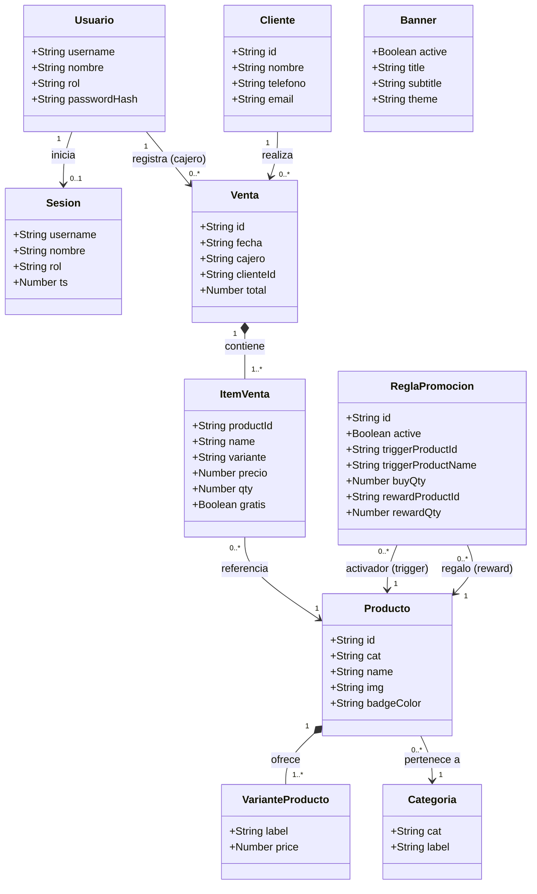
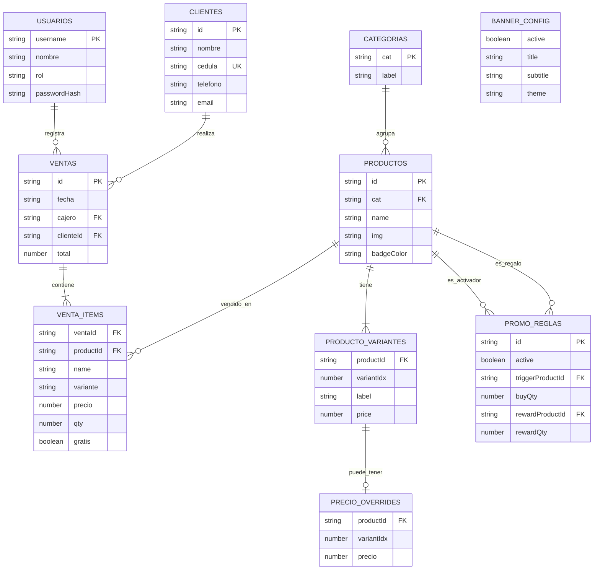
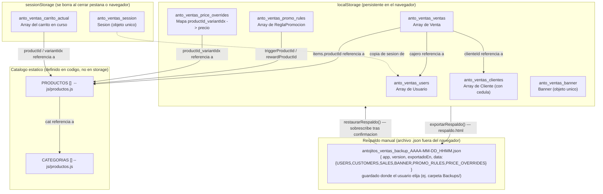
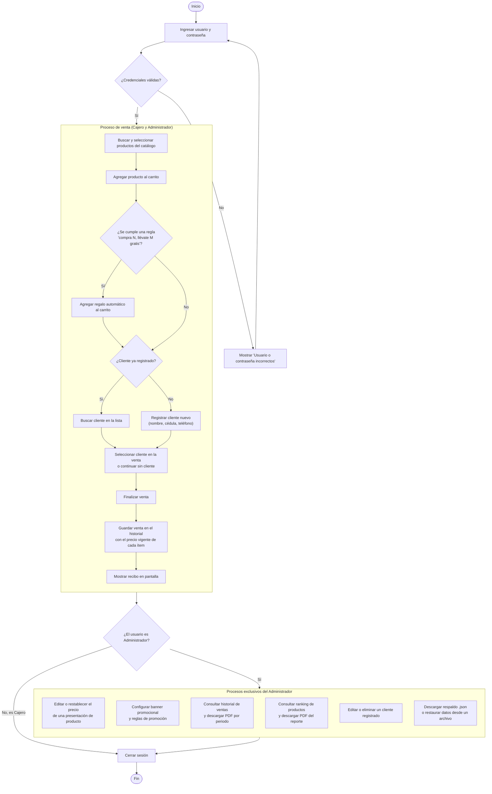
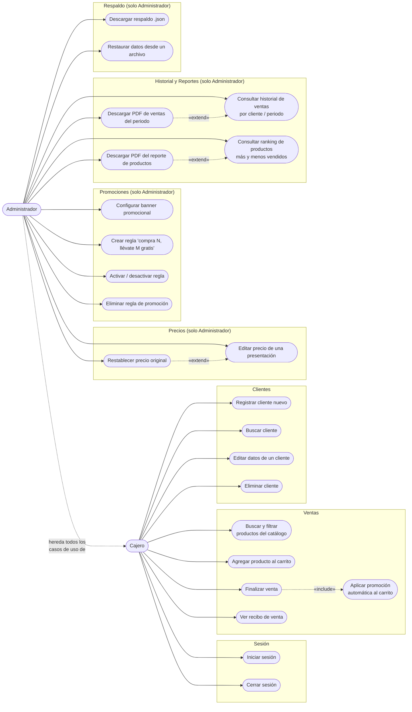
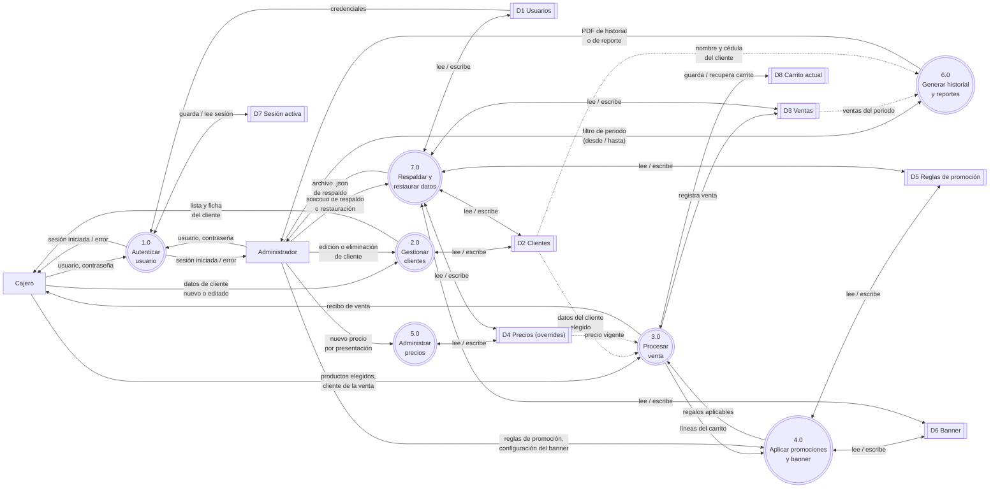

# Diagramas — Módulo de Ventas y Promociones

Esta carpeta contiene 6 diagramas del módulo, escritos en **Mermaid** (texto que se
renderiza como diagrama). Cada uno existe como archivo `.mmd` independiente
(para exportar) y también está embebido más abajo en este `README.md` (para
verlo directamente en GitHub o en el preview de VS Code).

| Archivo | Contenido |
|---|---|
| `diagrama_clases.mmd` | Diagrama de clases UML (entidades del módulo, atributos y relaciones) |
| `diagrama_er.mmd` | Diagrama Entidad-Relación (modelo de datos tipo tablas, incluye cédula del cliente y overrides de precio) |
| `diagrama_almacenamiento.mmd` | Estructura de la "base de datos": qué se guarda en `localStorage` vs `sessionStorage` vs catálogo estático en código, y el flujo de respaldo/restauración manual |
| `diagrama_flujo_procesos.mmd` | Diagrama de flujo del proceso operativo: inicio de sesión, proceso de venta y procesos exclusivos del administrador |
| `diagrama_caso_uso.mmd` | Diagrama de casos de uso: actores (Cajero, Administrador) y las acciones que puede realizar cada uno |
| `diagrama_flujo_datos.mmd` | Diagrama de Flujo de Datos (DFD) Nivel 1: entidades externas, 7 procesos numerados y los 8 almacenes de datos que consumen/producen |

> **Nota:** el diagrama ER y el de casos de uso reflejan los permisos reales
> de `js/auth.js` (`ROLES_PERMISOS`): el rol `cajero` puede operar ventas y
> clientes (crear, editar y eliminar), y solo `administrador` tiene acceso a
> precios, promociones, historial, reportes y respaldo.

> **Nota importante:** este módulo no usa una base de datos SQL real. Por la
> restricción académica de usar solo HTML/CSS/JS sin backend, todo se persiste
> como JSON en `localStorage` del navegador (ver `js/store.js`, `STORE_KEYS`).
> El diagrama ER modela esos datos *como si fueran tablas* para fines de
> documentación, y el diagrama de almacenamiento muestra la estructura real.
>
> Desde la pestaña **💾 Respaldo** (solo visible para el rol `administrador`)
> se puede descargar un archivo `.json` con una copia de todo lo anterior
> (excepto la sesión activa) y restaurarlo más tarde — ver `js/backup.js` y
> `respaldo.html`. El diagrama de almacenamiento incluye ahora ese archivo de
> respaldo y las funciones `exportarRespaldo()` / `restaurarRespaldo()` que lo
> conectan con `localStorage`.

---

## 1. Diagrama de clases (UML)



---

## 2. Diagrama Entidad-Relación (ER)



---

## 3. Estructura de almacenamiento (localStorage / sessionStorage)



---

## 4. Diagrama de flujo de procesos

Flujo operativo del módulo: inicio de sesión, el proceso de venta (compartido
por Cajero y Administrador) y los procesos exclusivos del rol `administrador`.



---

## 5. Diagrama de casos de uso

Actores: **Cajero** y **Administrador**. El Administrador hereda todos los
casos de uso del Cajero (ambos roles tienen acceso a Ventas y Clientes según
`ROLES_PERMISOS` en `js/auth.js`) y además tiene acceso exclusivo a Precios,
Promociones, Historial, Reportes y Respaldo.



---

## 6. Diagrama de Flujo de Datos (DFD) — Nivel 1

Entidades externas (Cajero, Administrador), 7 procesos numerados y los 8
almacenes de datos que leen o escriben (`D1`-`D6` en `localStorage`, `D7` y
`D8` en `sessionStorage`). `D4` no existía cuando se hizo el diagrama ER
original — se agregó junto con el módulo de precios editables.



---

## Cómo exportar estos diagramas a PNG

Tienes 3 opciones, de la más fácil (sin instalar nada) a la más automatizable.

### Opción A — Mermaid Live Editor (recomendada, no requiere instalar nada)

1. Abre https://mermaid.live en el navegador.
2. Abre uno de los archivos `.mmd` de esta carpeta (p. ej. `diagrama_clases.mmd`)
   con el Bloc de notas o VS Code, selecciona todo el contenido (`Ctrl+A`) y
   cópialo (`Ctrl+C`).
3. Pega el contenido (`Ctrl+V`) en el panel izquierdo ("Code") de mermaid.live.
   El diagrama se dibuja automáticamente en el panel derecho.
4. Ve al menú **Actions** (arriba) → **Export as PNG** (o el ícono de descarga).
   Se descarga el archivo `.png` a tu carpeta de Descargas.
5. Repite para los otros 5 archivos (`diagrama_er.mmd`,
   `diagrama_almacenamiento.mmd`, `diagrama_flujo_procesos.mmd`,
   `diagrama_caso_uso.mmd`, `diagrama_flujo_datos.mmd`).

### Opción B — Extensión de Mermaid en VS Code

1. Instala la extensión **"Markdown Preview Mermaid Support"** (autor: `bierner`)
   desde el panel de Extensiones de VS Code.
2. Abre este archivo `README.md` en VS Code.
3. Presiona `Ctrl+Shift+V` para abrir la vista previa de Markdown — los 6
   diagramas se renderizarán directamente ahí.
4. Para exportar como imagen: haz clic derecho sobre el diagrama renderizado
   en la vista previa → **"Save image as..."** (o usa una extensión adicional
   como **"Markdown PDF"**, que también puede exportar los diagramas
   embebidos a PNG/PDF).

### Opción C — Línea de comandos con `mmdc` (Mermaid CLI, ideal para generar los 6 de una vez)

Requiere tener **Node.js** instalado (https://nodejs.org).

```bash
# 1. Instalar el CLI de Mermaid (una sola vez)
npm install -g @mermaid-js/mermaid-cli

# 2. Pararse en esta carpeta de diagramas
cd "Modulo_Ventas_Promociones/Diagramas"

# 3. Exportar cada diagrama a PNG (-s 3 = triple resolución, para que se
#    lea bien en Word/PowerPoint/impreso; el layout no cambia, solo la nitidez)
mmdc -i diagrama_clases.mmd -o diagrama_clases.png -b white -s 3
mmdc -i diagrama_er.mmd -o diagrama_er.png -b white -s 3
mmdc -i diagrama_almacenamiento.mmd -o diagrama_almacenamiento.png -b white -s 3
mmdc -i diagrama_flujo_procesos.mmd -o diagrama_flujo_procesos.png -b white -s 3
mmdc -i diagrama_caso_uso.mmd -o diagrama_caso_uso.png -b white -s 3
mmdc -i diagrama_flujo_datos.mmd -o diagrama_flujo_datos.png -b white -s 3
```

Esto genera los 6 archivos `.png` correspondientes en la misma carpeta
(ya están generados a esta resolución; solo necesitas repetir este comando
si editas un `.mmd` y quieres regenerar su PNG). El flag `-b white` fuerza
fondo blanco (por defecto es transparente, lo cual puede verse mal si luego
pegas la imagen en Word/PowerPoint sobre fondo blanco). El flag `-s 3`
(factor de escala de Puppeteer, como una pantalla retina) triplica la
densidad de píxeles del PNG exportado sin cambiar el layout — es lo que hace
que el texto se vea nítido incluso haciendo zoom o imprimiendo en grande. Si
aun así lo necesitas más grande, puedes subir a `-s 4` o `-s 5`.
